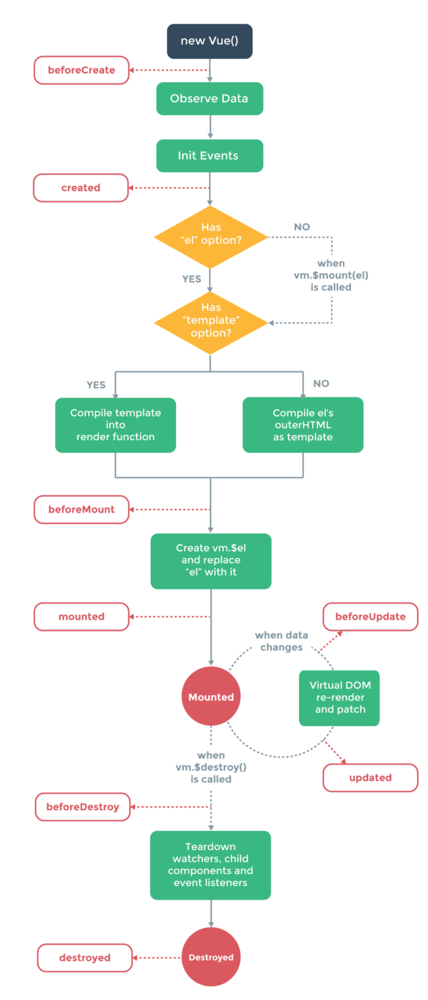

vue의 라이프 사이클
-
* beforeCreate : 인스턴스 내부 이벤트와 라이프 사이클 초기화 된 후 => 맨 처음 호출  
* created : DOM은 업데이트 되지 않아, 사용자는 UI를 볼 수 없으나 data 프로퍼티는 사용이 가능한 상태  
* beforeMount: vue가 템플릿 컴파일을 마치고 생성된 DOM을 랜더링할 준비가 된 후 => js는 동작 가능한 상태로, 기본 html 태그가 생성된 상태 (내부는 뷰의 랜더링을 마치지 않은 상태)  
* mounted: DOM이 업데이트 된 후 호출 됨. 이때는 UI가 보임
* beforeUpdate: 뷰가 관리하는 데이터가 변경 되기 이전에 호출 
* updated: DOM이 데이터 변경 사항을 기반으로 업데이트 된 후 호출 => 데이터 변경사항에 맞춰 다시 랜더링 한 이후
* activated: keep-alive 컴포넌트가 활성화 될 때 => 추상 엘리먼트로(태그) 주로 엘리먼트를 보존하거나 재 랜더링 하는데 사용
* deactivated: keep-alive 컴포넌트가 비활성화 될 때
* beforeDestroy: 인스턴스가 파괴되기 전에 호출. 이 단계에서 인스턴스는 여전히 완전한 기능 수행
* destroyed: 인스턴스가 파괴된 후 호출. 인스턴스의 모든 지시자 바인딩이 해제 됨. 이벤트 리스너가 제거되고 모든 하위 인스턴스가 차괴됨
* errorCaptured: 자손컴포넌트에서 에러가 검출 될 때마다 호출
---
